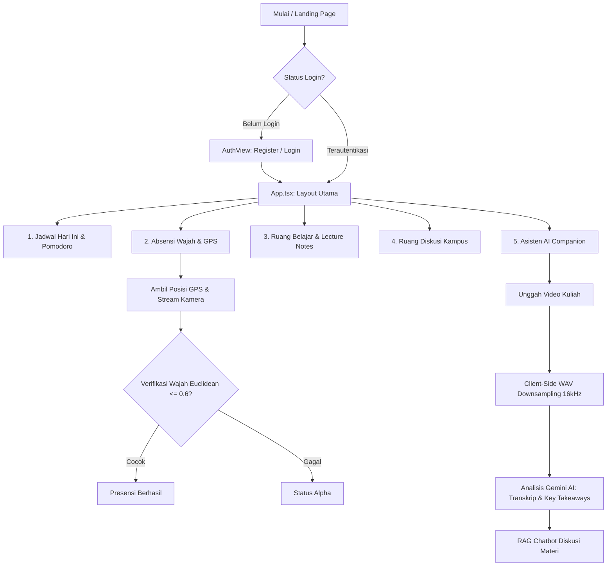

# Planly — Ruang Kerja Akademik Mahasiswa (Web & Mobile Backend)

<!-- Badges Section -->
<div align="center">

[](https://vite.dev/)
[](https://react.dev/)
[](https://laravel.com/)
[](https://tailwindcss.com/)
[](https://deepmind.google/technologies/gemini/)

</div>

---

**Planly** adalah platform web perencana akademik premium yang dirancang khusus untuk meningkatkan produktivitas belajar mahasiswa. Aplikasi ini menggabungkan pengelolaan jadwal kuliah otomatis, manajemen tugas kuliah, catatan materi berformat Markdown, verifikasi presensi kehadiran menggunakan kamera (Face Biometrics), asisten kuliah pintar menggunakan Gemini AI, hingga ekspor jadwal ke Google Calendar secara instan.

Platform ini mendukung **Dual-Mode API** (Simulasi Lokal / Mock vs Koneksi Laravel Backend) untuk kemudahan pengembangan dan paritas penuh dengan target pengembangan aplikasi mobile Flutter.

---

## 🗺️ Alur Pengguna (User Flow)

Berikut adalah visualisasi alur aktivitas mahasiswa di dalam ekosistem **Planly**:



---

## 🚀 Fitur Utama

### 📅 Perencana & Jadwal Kuliah Dinamis
* **Dasbor "Hari Ini" (Today Dashboard)**: Halaman pemantau agenda harian yang merangkum jadwal kuliah aktif, status kuliah realtime (*pulsing indicator*), daftar tugas terdekat, dan widget pengontrol fokus Pomodoro.
* **Timeline Jadwal & Kalender Dinamis**: Kalender interaktif bulanan dan mingguan yang terintegrasi dengan status kelas normal, pergeseran jadwal kelas kuliah (*reschedules*), serta pembatalan kelas (*canceled*).

### 👥 Ruang Diskusi Kampus (Campus Discussion Room)
* **Kategori Kanal (Channels)**: Berbagi informasi dan tanya jawab terorganisir per topik (#umum, #tugas-kuliah, #rapat-himpunan, #study-club, #tips-tricks).
* **Interaksi Sosial**: Fitur untuk menyukai (like) topik, melihat tanggapan, serta menambahkan komentar secara langsung dan real-time.
* **Fitur Pencarian & Pembuatan Topik**: Cari bahasan diskusi secara instan dan buat topik baru melalui formulir input yang intuitif.

### 📷 Verifikasi Kehadiran Cerdas (Class Attendance & Biometrics)
* **Face Recognition**: Deteksi struktur wajah dan pencocokan descriptor wajah real-time menggunakan pustaka `@vladmandic/face-api` (membandingkan live webcam descriptor dengan descriptor wajah terdaftar di profil mahasiswa dengan threshold Euclidean Distance <= 0.6).
* **GPS Geofencing**: Pengukuran kesesuaian koordinat GPS posisi mahasiswa dengan koordinat kelas untuk validasi presensi.
* **Statistik & Rekap Kehadiran**: Grafik visualisasi persentase kehadiran per mata kuliah dengan warning otomatis di bawah syarat minimal 75%.

### 🤖 Asisten Kuliah AI (AI Companion & Chatbot)
* **Ekstraktor Audio Client-Side**: Mengompres dan mengekstrak audio biner (WAV format 16000Hz mono) dari rekaman video kuliah langsung di sisi client (mengurangi transfer data hingga 50x).
* **Gemini AI Analysis**: Menghasilkan transkrip bertimestamp otomatis, daftar ringkasan topik (chapters), poin penting (takeaways), dan kartu pengayaan Google Search.
* **RAG Chatbot**: Chatbot interaktif untuk tanya jawab materi berbasis konteks transkrip kuliah dengan pembatasan domain (menolak pertanyaan di luar materi kuliah).

### 📝 Manajemen Tugas & Catatan Belajar
* **Format LaTeX KaTeX**: Pratinjau catatan yang mendukung penulisan rumus matematika block (`$$formula$$` dengan stateful multiline parser) dan inline (`$formula$`) secara asli menggunakan KaTeX.
* **Markdown Parser & Direct-to-Link**: Mengonversi penanda tebal (`**`) dan miring (`*`) asterisk ke elemen visual HTML asli serta mengubah link markdown `[Label](URL)` menjadi tombol pill interaktif ("Direct-to-Link").
* **Checkpoint Catatan**: Editor checklist materi kuliah yang dapat dicentang langsung pada masonry grid dasbor utama.

---

## 🛠️ Stack Teknologi

### Frontend (Client)
* **Framework**: React 19 (TypeScript)
* **Build Tool**: Vite 6
* **Styling**: TailwindCSS v4 & Vanilla CSS
* **Ikonografi**: Lucide React
* **Math Rendering**: KaTeX 0.17
* **Face Biometrics**: Face-api.js (`@vladmandic/face-api`)
* **AI Client SDK**: Google Gen AI SDK (`@google/genai`)
* **Animasi**: Framer Motion / Motion

### Backend (API Server)
* **Framework**: Laravel 11
* **Autentikasi**: Sanctum (Bearer Token)
* **Database**: MySQL / MariaDB
* **Direktori API**: `/planly-api`

---

## 📦 Panduan Instalasi & Kloning

### 1. Kloning Repositori
```bash
git clone https://github.com/username/planly-website.git
cd planly-website
```

### 2. Jalankan Frontend (React)
Instal dependensi dan jalankan server lokal:
```bash
npm install
npm run dev
```
*Aplikasi frontend berjalan di alamat `http://localhost:3000`.*

### 3. Jalankan Backend (Laravel API)
Masuk ke folder backend, instal dependensi, dan nyalakan server lokal:
```bash
cd planly-api
composer install
php artisan key:generate
php artisan migrate --seed
php artisan serve
```
*API Server berjalan di alamat `http://localhost:8000`.*

### 4. Konfigurasi Environment Variables (`.env`)
Buat berkas `.env` pada root directory proyek dengan isian:
```env
# Set 'true' untuk database lokal (localStorage), set 'false' untuk menggunakan API Laravel
VITE_USE_MOCK=false
VITE_API_BASE_URL=http://localhost:8000/api
```

---

## 📂 Struktur Folder Proyek

```txt
planly-website/
├── planly-api/                # Backend API Laravel 11 & DB Migrations
├── src/
│   ├── components/            # Komponen visual modular per-fitur
│   │   ├── attendance/        # Verifikasi wajah & riwayat absen
│   │   ├── auth/              # Halaman masuk/daftar
│   │   ├── calendar/          # Timeline jadwal & grid bulanan
│   │   ├── courses/           # Pendaftaran mata kuliah & input SKS
│   │   ├── discussion/        # Ruang Diskusi Kampus (Forum & Komentar)
│   │   ├── events/            # Agenda non-kuliah kampus
│   │   ├── notes/             # Catatan materi & editor Markdown (LaTeX)
│   │   ├── profile/           # Bento settings layout & ekspor kalender
│   │   ├── tasks/             # Pengelola tugas & file uploader
│   │   ├── today/             # Dasbor ringkasan hari ini & Pomodoro timer
│   │   └── ui/                # Reusable UI (InteractiveEmptyState, ApiKeyModal, dll.)
│   ├── hooks/                 # Custom Hooks (useFaceScanner, useAcademicData, useAppAuth)
│   ├── services/              # Modul REST API Laravel & Helper HTTP
│   ├── utils/                 # Utility helpers (security, iCal exporter, dll.)
│   ├── types.ts               # Interface Types TypeScript (snake_case)
│   ├── mockData.ts            # Dummy Data Awal Mahasiswa (Arief Sidik W.)
│   ├── App.tsx                # Entry point UI & Router Navigasi (Tab persistence)
│   └── main.tsx               # Bootstrapper React utama
├── API.md                     # Panduan endpoint REST API Laravel
├── BACKEND_INTEGRATION.md     # Panduan migrasi database & controller backend
└── PRD.md                     # Product Requirement Document (Paritas Fitur Mobile Flutter)
```