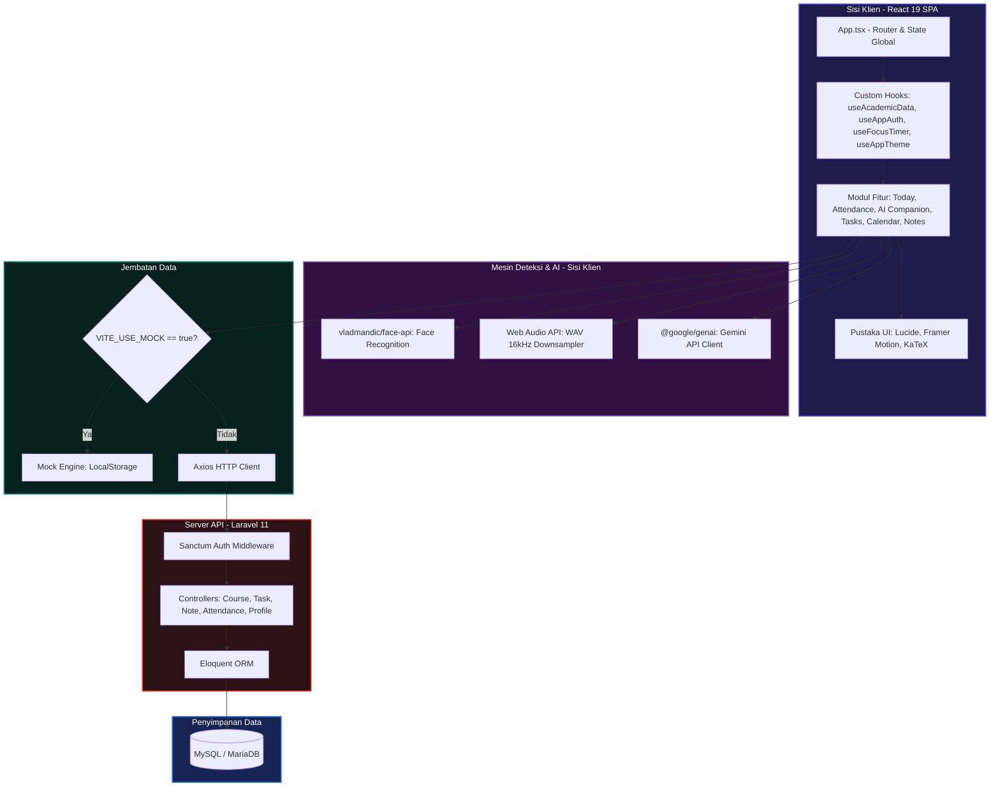
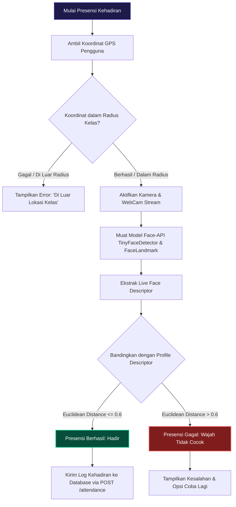
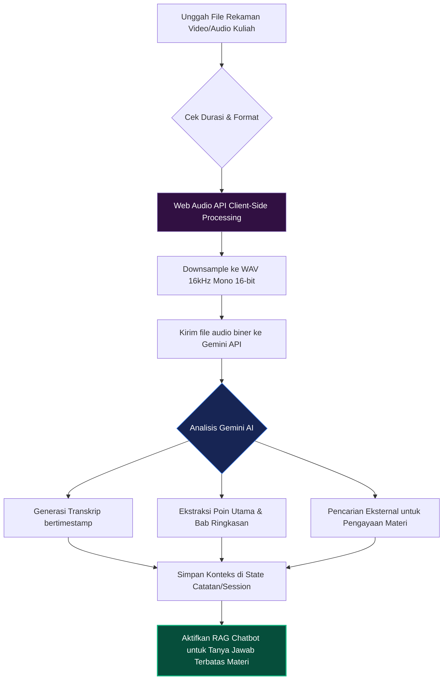

# Planly — Ruang Kerja Akademik Mahasiswa (Web & Mobile Backend)

<!-- Banner Section -->
<div align="center">
  
</div>

<!-- Badges Section -->
<div align="center">

### Frontend Ecosystem
[](https://vite.dev/)
[](https://react.dev/)
[](https://www.typescriptlang.org/)
[](https://tailwindcss.com/)
[](https://www.framer.com/motion/)
[](https://katex.org/)

### Backend & Database
[](https://laravel.com/)
[](https://laravel.com/docs/sanctum)
[](https://www.mysql.com/)
[](https://getcomposer.org/)

### AI & Biometrics
[](https://deepmind.google/technologies/gemini/)
[](https://github.com/vladmandic/face-api)

</div>

---

## 🌟 Tentang Planly

**Planly** adalah platform web perencana akademik premium yang dirancang khusus untuk meningkatkan produktivitas belajar mahasiswa. Aplikasi ini menggabungkan pengelolaan jadwal kuliah otomatis, manajemen tugas kuliah, catatan materi berformat Markdown, verifikasi presensi kehadiran menggunakan kamera (Face Biometrics), asisten kuliah pintar menggunakan Gemini AI, hingga ekspor jadwal ke Google Calendar secara instan.

Platform ini mendukung **Dual-Mode API** (Simulasi Lokal / Mock vs Koneksi Laravel Backend) untuk kemudahan pengembangan dan paritas penuh dengan target pengembangan aplikasi mobile Flutter.

---

## 🗺️ Alur & Arsitektur Sistem

Berikut adalah arsitektur aliran data di dalam ekosistem **Planly** yang menghubungkan modul sisi klien, mesin deteksi biometrik/AI, jembatan data, hingga API Backend Laravel:



---

## 📊 Tabel Alur Kerja Pengguna (User Journey)

Tabel berikut merinci aktivitas pengguna pada setiap halaman, logika state yang menyokongnya, integrasi API, serta efek animasi interaktif yang diterapkan:

| Halaman / Fitur | Deskripsi Alur & Interaksi Pengguna | Custom Hook / State | API Endpoint (Live) | Animasi & Efek UI |
| :--- | :--- | :--- | :--- | :--- |
| **Landing & Auth** | Landing page edukatif untuk pengguna baru, dialihkan ke form login/register. | `useAppAuth` | `POST /auth/login`<br>`POST /auth/register` | Fade transition (200ms) & scaling modal (0.95 -> 1) |
| **Dasbor Hari Ini** | Memantau kuliah hari ini secara realtime, melacak status kelas, tugas mendesak, dan widget Pomodoro. | `useFocusTimer`<br>`useAcademicData` | `GET /courses` | **Pulsing Indicator** untuk kelas aktif, checklist coret dinamis |
| **Absensi Wajah** | Membuka kamera depan, mengambil koordinat GPS, memindai wajah, mencocokkan Euclidean distance. | `useFaceScanner`<br>(attendance) | `POST /attendance`<br>`GET /attendance/history` | **Scanning Radar Loop** (garis laser hijau vertikal), indikator sukses berkedip |
| **Asisten AI** | Mengunggah video rekaman kuliah, downsample audio client-side, transkripsi Gemini, tanya jawab materi RAG. | `useFocusTimer`<br>(workspace) | Direct Gemini API (Client SDK) | **Soundwave Pulse** (tinggi bar audio acak dinamis), chatting fade-in |
| **Kalender Jadwal** | Menampilkan timeline kelas mingguan, navigasi tanggal horizontal, modifikasi sesi terjadwal (*reschedule*). | `useAcademicData` | `GET /courses`<br>`POST /reschedules` | Slide tab horizontal, border transition warna khusus per kelas |
| **Daftar Tugas** | CRUD tugas kuliah dengan prioritas tinggi, tanggal batas waktu relatif, melampirkan file materi tugas. | `useAcademicData`<br>`useDeadlineMonitor` | `POST /tasks`<br>`PUT /tasks/{id}` | Slide-over panel drawer dari sisi kanan (300ms ease-out) |
| **Catatan LaTeX** | CRUD catatan perkuliahan mendukung pratinjau matematika LaTeX (KaTeX) dan checklist masonry. | `useAcademicData` | `POST /notes`<br>`DELETE /notes/{id}` | Masonry grid transition, render instan formula matematika KaTeX |
| **Profil Pengguna** | Mengubah info profil, upload wajah referensi, ganti API Key Gemini, ekspor kalender .ics. | `useAppAuth`<br>`useAppTheme` | `PUT /profile`<br>ICal Generator | Dark/Light Mode adaptif transition (warna memudar halus) |

---

## ⚙️ Detail Alur Fitur Kunci

### 1. Verifikasi Kehadiran Cerdas (Face Biometrics & GPS Geofencing)
Proses validasi kehadiran mahasiswa dilakukan secara ketat di sisi klien sebelum data dikirim ke server backend untuk mencegah manipulasi kehadiran.



### 2. Pemrosesan Rekaman Kuliah Client-Side & Gemini AI RAG
Untuk meminimalkan beban bandwidth jaringan, audio diekstrak dan didownsample di sisi klien sebelum diunggah ke Gemini AI.



---

## 🛠️ Pustaka Pendukung Utama (Third-Party Libraries)

Aplikasi ini menggunakan berbagai pustaka pilihan untuk mengoptimalkan kinerja di sisi frontend dan backend:

| Nama Pustaka | Kategori | Peran & Kegunaan Utama dalam Planly | Dokumentasi Resmi |
| :--- | :--- | :--- | :--- |
| **@vladmandic/face-api** | Biometrik | Menjalankan model deteksi dan ekstraksi fitur wajah berbasis TensorFlow.js langsung di browser untuk verifikasi kehadiran. | [GitHub Repo](https://github.com/vladmandic/face-api) |
| **@google/genai** | Artificial Intelligence | Integrasi resmi ke model Gemini Flash untuk transkripsi audio kuliah, analisis RAG chatbot, dan kartu pencarian pengayaan materi. | [Docs](https://deepmind.google/technologies/gemini/) |
| **framer-motion** / **motion** | Animasi UI | Mengontrol animasi transisi halaman, efek slide-over panel pada manajemen tugas, dan micro-interactions pada tombol/kartu. | [Framer Motion Docs](https://www.framer.com/motion/) |
| **katex** | Math Rendering | Pustaka rendering formula matematika berkecepatan tinggi berbasis LaTeX untuk menulis rumus di catatan kuliah. | [KaTeX Docs](https://katex.org/) |
| **tw-animate-css** | Utilitas Animasi | Pustaka pendukung integrasi animasi css kustom yang terikat dengan kelas TailwindCSS untuk widget status visual. | [GitHub Repo](https://github.com/d-exclaimation/tw-animate-css) |
| **axios** | HTTP Client | Melakukan request asinkron (RESTful API calls) dari React Klien ke Laravel Backend dengan penanganan interceptor token. | [Axios Docs](https://axios-http.com/) |
| **laravel-sanctum** | Keamanan Backend | Menyediakan sistem autentikasi API berbasis token bearer (JWT-like) yang ringan untuk mengamankan endpoint data mahasiswa. | [Sanctum Docs](https://laravel.com/docs/sanctum) |

---

## 🚀 Panduan Instalasi & Kloning

### 1. Kloning Repositori
```bash
git clone https://github.com/username/planly-website.git
cd planly-website
```

### 2. Jalankan Frontend (React)
Instal dependensi dan jalankan server lokal:
```bash
npm install
npm run dev
```
*Aplikasi frontend berjalan di alamat `http://localhost:3000`.*

### 3. Jalankan Backend (Laravel API)
Masuk ke folder backend, instal dependensi, dan nyalakan server lokal:
```bash
cd planly-api
composer install
php artisan key:generate
php artisan migrate --seed
php artisan serve
```
*API Server berjalan di alamat `http://localhost:8000`.*

### 4. Konfigurasi Environment Variables (`.env`)
Pastikan berkas `.env` pada root directory proyek disesuaikan:
```env
# Set 'true' untuk database lokal (localStorage), set 'false' untuk menggunakan API Laravel
VITE_USE_MOCK=false
VITE_API_BASE_URL=http://localhost:8000/api
```

---

## 📂 Struktur Folder Proyek

```txt
planly-website/
├── assets/                    # Aset statis & ilustrasi (termasuk banner.svg)
├── planly-api/                # Backend API Laravel 11 & DB Migrations
│   ├── app/                   # Controller, Model, & Request API
│   ├── config/                # Konfigurasi laravel (auth, database, dll)
│   ├── database/              # Migrasi tabel database & seeders data awal
│   └── routes/                # Defini endpoint API (/routes/api.php)
├── src/
│   ├── components/            # Komponen visual modular per-fitur
│   │   ├── attendance/        # Verifikasi wajah & riwayat absen
│   │   ├── auth/              # Halaman masuk/daftar
│   │   ├── calendar/          # Timeline jadwal & grid bulanan
│   │   ├── courses/           # Pendaftaran mata kuliah & input SKS
│   │   ├── discussion/        # Ruang Diskusi Kampus (Forum & Komentar)
│   │   ├── events/            # Agenda non-kuliah kampus
│   │   ├── notes/             # Catatan materi & editor Markdown (LaTeX)
│   │   ├── profile/           # Bento settings layout & ekspor kalender
│   │   ├── tasks/             # Pengelola tugas & file uploader
│   │   ├── today/             # Dasbor ringkasan hari ini & Pomodoro timer
│   │   └── ui/                # Reusable UI (InteractiveEmptyState, ApiKeyModal, dll.)
│   ├── hooks/                 # Custom Hooks (useFaceScanner, useAcademicData, useAppAuth)
│   ├── services/              # Modul REST API Laravel & Helper HTTP
│   ├── utils/                 # Utility helpers (security, iCal exporter, dll.)
│   ├── types.ts               # Interface Types TypeScript (snake_case)
│   ├── mockData.ts            # Dummy Data Awal Mahasiswa (Arief Sidik W.)
│   ├── App.tsx                # Entry point UI & Router Navigasi (Tab persistence)
│   └── main.tsx               # Bootstrapper React utama
├── API.md                     # Panduan endpoint REST API Laravel
├── BACKEND_INTEGRATION.md     # Panduan migrasi database & controller backend
└── PRD.md                     # Product Requirement Document (Paritas Fitur Mobile Flutter)
```